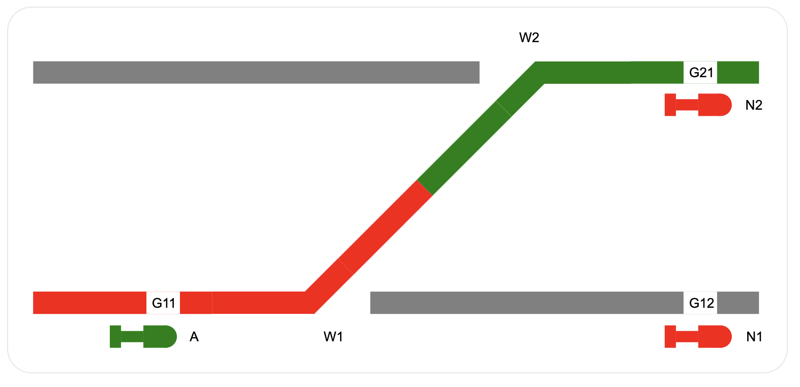

# OSM Interlocking
Design framework and examples for software-based railway interlocking logic.

This repository contains a framework for designing railway interlocking software.
It consists of a state machine language definition (syntax and semantics), compilers and simulators.

The end-to-end process of interlocking software design is illustrated using two example sets of block-based interlocking principles (referred to as *generic applications*):
 - **Locking Table Interlocking**, uses pre-populated configuration data to determine routes and their route elements
 - **Geographical Interlocking**, uses an online path finding algorithm to enumerate route elements, inspired by relay interlocking designs.

Both generic applications implement approach locking, automatic (train-triggered) route release, manual route release including ETCS/RBC support and staggered point operation.
An example parameterization exists for each design (*specific application*) which is useful for interactive testing and exploration.

The present language definition provides the foundation for a formal verification of safety properties on the specific application model.
An additional compiler/transformation tool for a formal model checking language can be added for this purpose.
The formal verification of generic application models likely requires formal constraint expressions within the entity type definitions, which is not currently supported.

## Interlocking Functions

The following paragraphs briefly introduce the aforementioned railway concepts.
For more details, please refer to Jörn Pachl's [Railway Signalling Principles](http://www.joernpachl.de/rsp.pdf).

**Approach Locking**  
In the lifecycle of a train route in the interlocking, the route elements (points and track sections) must remain locked once the entry signal opens (signal-dependent locking) and after the signal was closed but the train has not yet left the route (signal-independent locking).
Moreover, route locking must remain in place when the train approaches the signal, even if the signaller attempts to manually close the signal at this late point in time (approach locking).
To detect an approaching train, the occupancy of the designated approach section is evaluated, and any oncoming train under supervision of an ETCS RBC provides information about its ability to stop ahead of the signal.

**Automatic Route Release**  
Automatic route release is activated by the occupancy and release of the designated release trigger zone of a route.
Automatic route release puts the route back into its initial state, which also allows to set it again for a subsequent train.
However, automatic route release does not imply that all route elements are immediately unlocked.
Rather, the locking and stepwise unlocking of route elements after the route release is managed by *transit* entities.

**Manual Route Release**  
The signaller can manually release a route if the approach locking conditions do not prevent the release.

**Staggered Point Machine Operation**  
A single route setting command typically triggers multiple point machines (electric motors) which operate the point blades.
Often, many point machines share the same power supply.
When multiple point machines are powered on at the same time due to the commanding of a route, a current spike can cause damage to the power supply.
Hence, although a staggered point machine operation is not a safety-related function, it is present within the core logic of many interlocking systems.

## Interlocking Software Design Language (Meta Model)

[Language Semantics Documentation](language/README.md)

**ANTLR Language Grammars**

 - [Expression](language/Expression.g4) ([Syntax Diagram](https://osmhpi.github.io/interlocking/rrd/))
 - [Graph](language/Graph.g4), subset of PlantUML State Diagrams

**JSON Schema Definitions**
 - [Entity Type](language/entity_type.schema.json)
 - [Enums](language/enums.schema.json)
 - [Graph Terms](language/graph.terms.schema.json)
 - [Interface](language/interface.schema.json)
 - [Schedule](language/schedule.schema.json)

## Reference Interlocking Designs

| | Locking Table Interlocking | Geographical Interlocking |
|-|-|-|
| | [🌍 Simulator](https://osmhpi.github.io/interlocking/locking_table_interlocking/) | [🌍 Simulator](https://osmhpi.github.io/interlocking/geographical_interlocking/) |
| **Generic Application** |
| Entity Types | [entity_types](locking_table_interlocking/generic_application/entity_types) | [entity_types](geographical_interlocking/generic_application/entity_types)
| Graphs | [graphs](locking_table_interlocking/generic_application/graphs) | [graphs](geographical_interlocking/generic_application/graphs) |
| Interfaces | [interfaces](locking_table_interlocking/generic_application/interfaces) | [interfaces](geographical_interlocking/generic_application/interfaces) |
| Enums | [enums.yaml](locking_table_interlocking/generic_application/enums.yaml) | [enums.yaml](geographical_interlocking/generic_application/enums.yaml) |
| Schedule | [schedule.yaml](locking_table_interlocking/generic_application/schedule.yaml) | [schedule.yaml](geographical_interlocking/generic_application/schedule.yaml) |
| Generated Configuration JSON Schema | [configuration.schema.json](locking_table_interlocking/simulator/configuration.schema.json) | [configuration.schema.json](geographical_interlocking/simulator/configuration.schema.json) |
| **Specific Application** |
| Configuration JSON | [configuration.json](locking_table_interlocking/specific_application/configuration.json) | [configuration.json](geographical_interlocking/specific_application/configuration.json) |
| Web-based Simulator | [simulator](locking_table_interlocking/simulator) | [simulator](geographical_interlocking/simulator) |

## Setup and Development

Prerequisites (as tested, newer versions may work as well):
 - .NET 8.0 SDK
 - Rust 1.91.1
 - Node.js 22 and npm
 - Antlr 4.13.2
 - wasm-pack 0.13.1
 - make

For a simplified setup, a VS Code Devcontainer configuration file is provided.

To compile and run the web-based debugging interface, run `make web` from the [locking_table_interlocking](locking_table_interlocking) or [geographical_interlocking](geographical_interlocking) directories, then open http://localhost:3000/.
